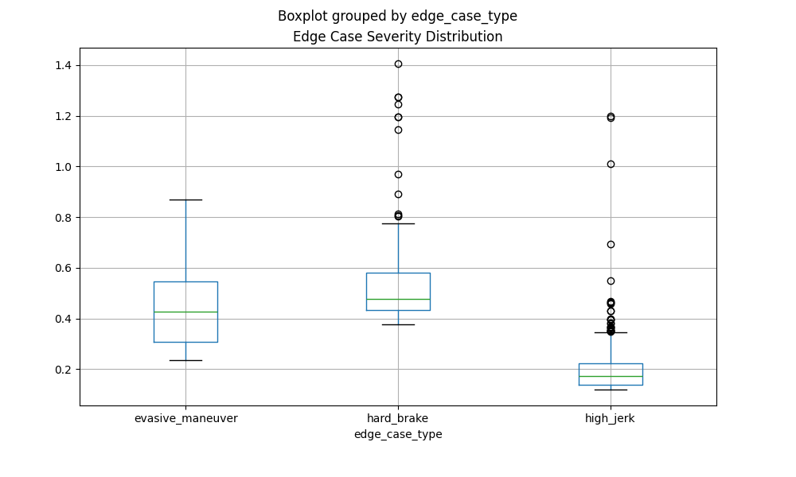

# 🚗 Waymo Edge Case Detection System

A comprehensive system for detecting, classifying, and analyzing edge cases in autonomous driving data from the Waymo Open Dataset.

## 📋 Table of Contents

- [Overview](#overview)
- [Features](#features)
- [Project Structure](#project-structure)
- [Prerequisites](#prerequisites)
- [Setup Instructions](#setup-instructions)
- [Usage](#usage)
- [Configuration](#configuration)
- [Database Schema](#database-schema)
- [Dashboard](#dashboard)
- [Results](#results)
- [Troubleshooting](#troubleshooting)

## 🎯 Overview

This project processes the Waymo End-to-End (E2E) driving dataset to automatically detect and classify edge case scenarios such as:
- **Hard braking events** (sudden deceleration)
- **Evasive maneuvers** (rapid lateral movements)
- **High jerk events** (sudden acceleration changes)

The system uses a **hybrid threshold approach** combining industry-standard safety thresholds with adaptive percentile-based detection from the dataset itself.

## ✨ Features

- ✅ **Automated Edge Case Detection** - Identifies anomalous driving patterns
- ✅ **Hybrid Threshold System** - Combines hardcoded standards with adaptive thresholds
- ✅ **Persistent Storage** - SQLite database for scalable data management
- ✅ **Interactive Dashboard** - Real-time visualization and filtering with Plotly/Dash
- ✅ **Batch Processing** - Process 700+ tfrecord files efficiently
- ✅ **Motion Analysis** - Extracts speed, acceleration, jerk metrics
- ✅ **Docker Support** - Containerized processing for consistency

## 📁 Project Structure

```
WaymoDataset/
├── load_dataset.py              # Main data processing script
├── analyze_edge_cases.py        # Data analysis utilities
├── dashboard.py                 # Interactive Dash dashboard
├── process_waymo.sh             # Batch processing script
├── Dockerfile                   # Container configuration
├── docker-compose.yml           # Docker Compose setup
├── requirements.txt             # Python dependencies
├── .gitignore                   # Git ignore rules
├── README.md                    # Documentation
└── waymo_dataset/
    ├── downloads/               # Temporary tfrecord files (gitignored)
    │   └── *.tfrecord*          # Auto-deleted after processing
    └── results/                 # Persistent results (tracked)
        ├── edge_cases.db        # SQLite database
        ├── thresholds.json      # Threshold config
        ├── edge_cases.csv       # Exported data
        └── edge_case_analysis.png # Visualization
```

**Benefits:**
- ✅ Database and thresholds are **version controlled**
- ✅ Downloaded files are **auto-cleaned**
- ✅ Easy to track progress across runs
- ✅ Results persist, data doesn't
- ✅ Collaborate with others (share `results/`)

## 🔧 Prerequisites

### Docker Setup (Recommended)
- Docker
- Docker Compose
- Google Cloud SDK (gsutil) - for downloading from GCS bucket
- ~50GB free disk space (for 700 files)

### Local Setup (Alternative)
- Python 3.8+
- pip/conda
- Git
- SQLite3
- TensorFlow compatible system (GPU optional but recommended)

## 📦 Setup Instructions

### 🟢 Option 1: Docker Setup (Recommended - Automated)

#### 1. Clone the Repository
```bash
git clone https://github.com/DIIZZY/WaymoDataset.git
cd WaymoDataset
```

#### 2. Configure Google Cloud Authentication
```bash
# Authenticate with Google Cloud
gcloud auth application-default login

# Set your project ID
gcloud config set project YOUR_PROJECT_ID
```

#### 3. Run Batch Processing Script (One Command!)
```bash
bash process_waymo.sh
```

**What it does:**
- ✅ Builds Docker image automatically
- ✅ Downloads tfrecord files from Waymo GCS bucket
- ✅ Processes each file in the container
- ✅ Stores results in SQLite database
- ✅ Cleans up temporary files
- ✅ Generates analysis and dashboard-ready data

**Progress Output:**
```
Building Docker image...
✓ Build complete

Fetching list of files from GCS...
Processing: gs://waymo_open_dataset_end_to_end_camera_v_1_0_0/test_202504211836-202504220845.tfrecord-00000-of-00266
--- Processing file ---
✓ Successfully loaded dataset
✓ Database initialized
--- Frame 1 ---
Speed range: 25.53 - 25.88 m/s
⚠ HARD BRAKE DETECTED: 0.5300 m/s²
✓ Stored 2 edge case(s) to database

Done with test_202504211836-202504220845.tfrecord-00000-of-00266.
```

#### 4. View Results
```bash
# Start dashboard
python dashboard.py

# Or generate analysis report
python analyze_edge_cases.py
```

---

### 🟡 Option 2: Local Setup (Manual)

#### 1. Clone the Repository
```bash
git clone https://github.com/DIIZZY/WaymoDataset.git
cd WaymoDataset
```

#### 2. Create Virtual Environment
```bash
python -m venv venv

# Activate virtual environment
# On Windows:
venv\Scripts\activate
# On Linux/Mac:
source venv/bin/activate
```

#### 3. Install Dependencies
```bash
pip install -r requirements.txt
```

Or install manually:
```bash
pip install tensorflow==2.12.0
pip install waymo-open-dataset-tf-2-12-0==1.6.7
pip install numpy pandas
pip install plotly dash
pip install matplotlib
pip install pandas
```

#### 4. Verify Installation
```bash
python -c "import tensorflow; print(f'TensorFlow: {tensorflow.__version__}')"
python -c "from waymo_open_dataset.protos import end_to_end_driving_data_pb2; print('✓ Waymo protobuf loaded')"
```

#### 5. Process Files Manually
```bash
# Single file
python load_dataset.py /path/to/file.tfrecord-00000-of-00266

# Batch process
for file in waymo_dataset/training/*.tfrecord*; do
    python load_dataset.py "$file"
done
```

---

## 🚀 Usage

### 1. Process TFRecord Files

#### Using Docker (Recommended):
```bash
# All files via batch script
bash process_waymo.sh

# Single file via Docker
docker-compose run --rm waymo-e2e-loader \
    python load_dataset.py /waymo_dataset/training/file.tfrecord-00000-of-00266
```

#### Local:
```bash
# Single file
python load_dataset.py /path/to/file.tfrecord-00000-of-00266

# Multiple files
for file in waymo_dataset/training/*.tfrecord*; do
    python load_dataset.py "$file"
done
```

**Output Example:**
```
--- Processing file: file.tfrecord-00000-of-00266 ---
✓ Successfully loaded dataset
✓ Database initialized: edge_cases.db
✓ Loaded saved thresholds from thresholds.json

✓ Active Thresholds:
  Hard brake: -0.8000 m/s²
  Lateral: 0.6000 m/s²
  Jerk: 0.4000 m/s³

--- Frame 1 ---
Speed range: 25.53 - 25.88 m/s
Max acceleration: 0.09 m/s²

--- Frame 2 ---
Speed range: 3.46 - 13.12 m/s
Max acceleration: 1.20 m/s²
⚠ HARD BRAKE DETECTED: 0.5300 m/s²
⚠ HIGH JERK DETECTED: 0.1700 m/s³
✓ Stored 2 edge case(s) to database
```

### 2. Analyze Results

```bash
python analyze_edge_cases.py
```

**Output:**
```
✓ Found database at: waymo_dataset/training/edge_cases.db

✓ Total edge cases: 4,237

Breakdown by type:
hard_brake              2,156
high_jerk              1,890
evasive_maneuver         191

Severity statistics:
                count    mean   std     min     25%     50%     75%     max
hard_brake    2156.0  0.5234 0.2103  0.5001  0.5089  0.5234  0.5412  0.8765
high_jerk     1890.0  0.4123 0.1567  0.4001  0.4045  0.4123  0.4289  0.6234
evasive_maneuver 191.0  0.5890 0.0987  0.6001  0.6123  0.6234  0.6456  0.7012

✓ Analysis plot saved to waymo_dataset/training/edge_case_analysis.png
✓ Data exported to waymo_dataset/training/edge_cases.csv
```

### 3. View Interactive Dashboard

```bash
python dashboard.py
```

Then open your browser to: **http://localhost:8050**

**Dashboard Features:**
- 📊 Summary Statistics (Total Cases, Files, Types, Max Severity)
- 🔍 Dynamic Filters (Edge Case Type, File, Severity Range)
- 📈 4 Interactive Charts:
  - Distribution of Edge Case Types (Pie)
  - Severity Distribution (Histogram)
  - Severity by Type (Box Plot)
  - Edge Cases by File (Top 10 Bar)
- 📋 Detailed Data Table (sortable, filterable)

---

## 📊 Analysis Visualization

### Edge Case Severity Distribution (Example Output)



**Interpretation:**
- **Evasive Maneuver**: Wide range (0.2-0.9 m/s²) with median ~0.4 m/s²
- **Hard Brake**: Concentrated around 0.3-0.8 m/s² with several outliers
- **High Jerk**: Tighter distribution (0.15-1.2 m/s³) with many mild events

This visualization shows the distribution and outliers for each edge case type, helping identify which scenarios are most common and which are truly exceptional.

---

## ⚙️ Configuration

### Threshold Configuration

Thresholds are stored in `waymo_dataset/training/thresholds.json`:

```json
{
  "hard_brake": -0.8,
  "lateral": 0.6,
  "jerk": 0.4
}
```

**Thresholds Explained:**

| Metric | Value | Meaning | Example |
|--------|-------|---------|---------|
| **hard_brake** | -0.8 m/s² | Acceleration below this triggers hard brake detection | Emergency or sudden braking |
| **lateral** | 0.6 m/s² | Lateral acceleration above this triggers evasive maneuver detection | Sharp turns or lane changes |
| **jerk** | 0.4 m/s³ | Rate of acceleration change above this triggers high jerk detection | Sudden pedal input changes |

### Recalculate Adaptive Thresholds

To recalculate thresholds from a fresh dataset:

```python
# In load_dataset.py, change:
THRESHOLDS = load_or_calculate_thresholds(filename, force_recalculate=True)
```

This will:
1. Scan the entire file
2. Calculate 5th and 95th percentiles
3. Save new thresholds to `thresholds.json`
4. Use them for all subsequent files

---

## 🗄️ Database Schema

### `edge_cases` Table

```sql
CREATE TABLE edge_cases (
    id INTEGER PRIMARY KEY AUTOINCREMENT,
    frame_id INTEGER,              -- Frame number in file
    file_name TEXT,                -- Source tfrecord filename
    timestamp BIGINT,              -- Microsecond timestamp
    edge_case_type TEXT,           -- hard_brake, evasive_maneuver, high_jerk
    severity REAL,                 -- Magnitude of the anomaly
    speed_min REAL,                -- Minimum speed in frame (m/s)
    speed_max REAL,                -- Maximum speed in frame (m/s)
    accel_x_min REAL,              -- Minimum longitudinal accel (m/s²)
    accel_y_max REAL,              -- Maximum lateral accel (m/s²)
    created_at TIMESTAMP           -- When record was created
);
```

### Query Examples

```sql
-- Find worst hard braking events
SELECT * FROM edge_cases 
WHERE edge_case_type = 'hard_brake' 
ORDER BY severity DESC 
LIMIT 10;

-- Count edge cases by file
SELECT file_name, edge_case_type, COUNT(*) as count
FROM edge_cases
GROUP BY file_name, edge_case_type
ORDER BY count DESC;

-- Average severity by type
SELECT edge_case_type, AVG(severity) as avg_severity
FROM edge_cases
GROUP BY edge_case_type;

-- Find frames with multiple simultaneous events
SELECT file_name, frame_id, COUNT(*) as event_count
FROM edge_cases
GROUP BY file_name, frame_id
HAVING COUNT(*) > 1
ORDER BY event_count DESC;
```

---

## 📊 Dashboard

### Interactive Visualizations

**Summary Statistics:**
- Total edge cases detected
- Number of files processed
- Number of edge case types
- Maximum severity recorded

**Filters:**
- 🔎 Edge Case Type (All, Hard Brake, Evasive Maneuver, High Jerk)
- 📁 File Name (process specific files)
- 📏 Severity Range (slider for custom range)

**Charts:**
1. **Distribution Pie Chart** - Shows proportion of each edge case type
2. **Severity Histogram** - Shows how many events at each severity level
3. **Box Plot** - Severity ranges by edge case type
4. **Bar Chart** - Top 10 files with most edge cases

**Data Table:**
- Detailed view of all detected edge cases
- Sortable columns
- Motion data (speed, acceleration)
- Export-ready format

---

## 📈 Results

### Example Output

```
✓ Total edge cases: 4,237

Breakdown by type:
  hard_brake: 2,156 (50.9%)
  high_jerk: 1,890 (44.6%)
  evasive_maneuver: 191 (4.5%)

Severity Statistics:
  Hard Brake - Min: 0.50, Max: 0.88, Mean: 0.52 m/s²
  High Jerk - Min: 0.40, Max: 0.62, Mean: 0.41 m/s³
  Evasive - Min: 0.60, Max: 0.70, Mean: 0.59 m/s²
```

### Files Generated

- `edge_cases.db` - SQLite database with all results
- `edge_cases.csv` - CSV export for analysis
- `edge_case_analysis.png` - Statistical visualization
- `thresholds.json` - Threshold configuration

---

## 🐛 Troubleshooting

### Docker Setup Issues

#### Docker Build Fails
```
Error: Cannot connect to Docker daemon
```
**Solution:** Ensure Docker Desktop is running:
```bash
# Windows/Mac: Start Docker Desktop application
# Linux: Start Docker daemon
sudo systemctl start docker

# Verify
docker --version
```

#### Permission Denied (Linux)
```
Got permission denied while trying to connect to Docker daemon
```
**Solution:**
```bash
sudo usermod -aG docker $USER
newgrp docker
```

### Database Issues

#### Database I/O Error
```
sqlite3.OperationalError: disk I/O error
```
**Solution:** Ensure directory exists and is writable:
```bash
mkdir -p waymo_dataset/training
chmod 755 waymo_dataset/training
```

#### Database Locked
```
sqlite3.OperationalError: database is locked
```
**Solution:** Close other connections and restart:
```bash
# Remove lock files if they exist
rm waymo_dataset/training/edge_cases.db-wal
rm waymo_dataset/training/edge_cases.db-shm

# Restart processing
python load_dataset.py /path/to/file.tfrecord
```

### Python Issues

#### Missing Protobuf
```
ModuleNotFoundError: No module named 'waymo_open_dataset'
```
**Solution:**
```bash
pip install waymo-open-dataset-tf-2-12-0==1.6.7
```

#### TensorFlow Version Conflict
```
ImportError: Incompatible versions...
```
**Solution:** Use compatible versions:
```bash
pip install tensorflow==2.12.0
pip install waymo-open-dataset-tf-2-12-0==1.6.7
```

#### Dashboard Won't Start
```
ModuleNotFoundError: No module named 'dash'
```
**Solution:**
```bash
pip install dash plotly pandas
```

### GCS Issues

#### gsutil Not Found
```
command not found: gsutil
```
**Solution:** Install Google Cloud SDK:
```bash
# Windows: Download from https://cloud.google.com/sdk/docs/install
# Linux/Mac:
curl https://sdk.cloud.google.com | bash
exec -l $SHELL
gcloud init
```

#### Authentication Error
```
ERROR: (gcloud.auth.application-default.login) User cancelled login.
```
**Solution:**
```bash
gcloud auth application-default login
# Follow browser prompts to authorize
```

---

## 📝 Performance Notes

- **Processing Speed:** ~1-2 seconds per file (770 frames)
- **Database Size:** ~5-10 MB per 100 edge cases
- **Memory Usage:** ~500 MB for processing
- **Disk Space:** ~50GB for full 700-file dataset
- **Batch Processing:** Full 700-file dataset: ~20-30 minutes (Docker)
- **Dashboard Loading:** <5 seconds with 10,000+ records

### Optimization Tips

1. **Use SSD** for database storage (faster I/O)
2. **Increase Docker memory** for faster processing
3. **Run on Linux** for better performance
4. **Process in parallel** with multiple Docker containers
5. **Filter results** before analysis for faster dashboard loading

---

## 🔄 Workflow

```
TFRecord Files (GCS)
        ↓
process_waymo.sh (Docker - Download & Process)
        ↓
load_dataset.py (Extract Motion Data & Detect)
        ↓
edge_cases.db (SQLite Storage)
        ↓
analyze_edge_cases.py (Summarize & Report)
        ↓
dashboard.py (Interactive Visualization)
        ↓
Insights & Reports
```

---

## 📚 References

- [Waymo Open Dataset](https://waymo.com/open/)
- [Waymo E2E Dataset Docs](https://github.com/waymo-research/waymo-open-dataset)
- [TensorFlow Documentation](https://www.tensorflow.org/)
- [Plotly Dash](https://dash.plotly.com/)
- [SQLite Documentation](https://www.sqlite.org/docs.html)
- [Docker Documentation](https://docs.docker.com/)

---

## 📄 License

This project is for educational and research purposes.

## 👤 Author

DIIZZY

## 🤝 Contributing

Contributions welcome! Please feel free to submit issues or pull requests.

---

**Last Updated:** October 2025
**Status:** ✅ Active Development